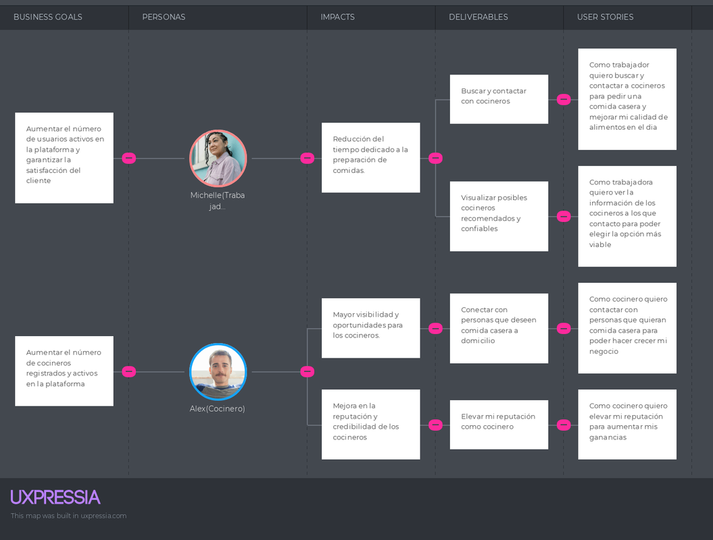

# Capítulo III: Requirements Specification
## 3.1. To-Be Scenario Mapping.
#### Universitarios y Profesionales Ocupados

| Phases                      | Buscar Comida                                                                          | Revisar Opciones                                                                   | Personalización de Pedido                                                         | Realización del Pedido                                                            | Recepción y Evaluación                                                             |
|-----------------------------|----------------------------------------------------------------------------------------|------------------------------------------------------------------------------------|-----------------------------------------------------------------------------------|-----------------------------------------------------------------------------------|------------------------------------------------------------------------------------|
| Doing                       | Usar la app para encontrar rápidamente opciones de comida casera local con filtros avanzados (precio, dieta). | Navegar por menús organizados y leer reseñas de otros usuarios para tomar una decisión informada. | Personalizar el pedido dentro de la app, seleccionando restricciones dietéticas y detalles específicos. | Confirmar el pedido y recibir una estimación precisa del tiempo de entrega.         | Recibir el pedido y dejar una reseña en la app con facilidad, además de recibir incentivos por hacerlo. |
| Thinking                    | "Esto es justo lo que necesito, rápido y fácil de encontrar."                          | "Me gusta poder ver reseñas y comparar fácilmente las opciones de comida."          | "Me siento seguro de que mis necesidades serán respetadas."                       | "Parece que todo está bajo control, sé cuándo llegará mi comida."                  | "Es fácil dejar mi reseña, y me motiva saber que podría recibir recompensas."      |
| Feeling                     | Alivio, ya que todo está en un solo lugar y las opciones son claras.                   | Confianza al tomar una decisión con base en las experiencias de otros usuarios.     | Tranquilidad y confianza en la personalización del pedido.                         | Seguridad y satisfacción con los tiempos de entrega claros.                        | Satisfacción por haber tenido una experiencia fluida y ser reconocido por reseñar.  |

#### Cocineros Caseros

| Phases                | Encontrar Clientes                                                                       | Publicar Menús                                                                        | Recibir Pedidos                                                                      | Entrega y Pago                                                                        | Revisar Reseñas                                                                       |
|-----------------------|-----------------------------------------------------------------------------------------|---------------------------------------------------------------------------------------|--------------------------------------------------------------------------------------|---------------------------------------------------------------------------------------|---------------------------------------------------------------------------------------|
| Doing                 | Usar la app para llegar a una base de clientes interesados en comida casera.             | Publicar menús fácilmente a través de la app, con la opción de actualizar automáticamente. | Recibir notificaciones automáticas de nuevos pedidos y gestionarlos desde una sola plataforma. | Usar la app para coordinar entregas y recibir pagos automáticamente.                 | Revisar y responder a reseñas directamente en la app, manteniendo una relación transparente con los clientes. |
| Thinking              | "Finalmente puedo encontrar clientes de manera constante y más organizada."               | "Es mucho más rápido y fácil actualizar mis menús ahora."                             | "Puedo gestionar todos mis pedidos desde un solo lugar, es más organizado."          | "No tengo que preocuparme por los pagos o las entregas, todo está controlado."        | "Puedo gestionar mi reputación fácilmente y responder rápidamente a las reseñas."     |
| Feeling               | Motivación por tener acceso a más clientes a través de la app.                            | Alivio por no tener que gestionar manualmente la actualización de los menús.          | Control y menos estrés al gestionar pedidos de forma centralizada.                   | Seguridad y satisfacción por la eficiencia en los pagos y entregas.                   | Satisfacción y control sobre la imagen profesional y la relación con los clientes.     |

## User Stories

| Epic / Story ID | Título                        | Descripción                                                                                                   | Criterios de Aceptación                                                                                                                                                                                    | Relacionado con (Epic ID) |
|---------|-------------------------------|---------------------------------------------------------------------------------------------------------------|------------------------------------------------------------------------------------------------------------------------------------------------------------------------------------------------------------|---------------------------|
| US001   | Registro de consumidor         | Como profesional ocupado, quiero registrarme en la plataforma para acceder a las opciones de comida casera.     | **Escenario 1:** Dado que el usuario ingresa sus datos, cuando todos sean válidos, entonces el sistema debe permitir el registro exitoso. **Escenario 2:** Dado que el usuario intenta registrarse con un correo ya usado, cuando lo haga, entonces el sistema debe mostrar un mensaje de error. **Escenario 3:** Dado que el usuario no completa los datos, cuando lo intente, entonces el sistema debe solicitar los campos obligatorios. | EP001                     |
| US002   | Búsqueda de comidas            | Como profesional ocupado, quiero buscar comidas cercanas a mi ubicación para encontrar opciones rápidas.        | **Escenario 1:** Dado que el usuario permite la geolocalización, cuando realice una búsqueda, entonces el sistema debe mostrar opciones cercanas. **Escenario 2:** Dado que el usuario no permite la geolocalización, cuando realice una búsqueda, entonces el sistema debe solicitarle una ubicación manual. **Escenario 3:** Dado que el usuario tiene restricciones dietéticas, cuando realice la búsqueda, entonces el sistema debe mostrar opciones que cumplan con sus preferencias. | EP002                     |
| US003   | Filtros avanzados de búsqueda  | Como profesional ocupado, quiero aplicar filtros avanzados para encontrar opciones de comida que se ajusten a mis necesidades. | **Escenario 1:** Dado que el usuario aplica un filtro por precio, cuando lo haga, entonces el sistema debe mostrar opciones dentro de su presupuesto. **Escenario 2:** Dado que el usuario aplica un filtro por distancia, cuando lo haga, entonces el sistema debe mostrar solo las opciones cercanas. **Escenario 3:** Dado que el usuario combina múltiples filtros, cuando lo haga, entonces el sistema debe mostrar solo las opciones que cumplan con todos los criterios. | EP002                     |
| US004   | Selección de menú personalizado | Como profesional ocupado, quiero personalizar mi pedido según mis preferencias para ajustar la comida a mis necesidades. | **Escenario 1:** Dado que el usuario selecciona un menú personalizado, cuando lo confirme, entonces el sistema debe reflejar las modificaciones en el resumen del pedido. **Escenario 2:** Dado que el usuario intenta agregar opciones no disponibles, cuando lo haga, entonces el sistema debe mostrar un mensaje de error. **Escenario 3:** Dado que el pedido es personalizado, cuando el cocinero lo acepte, entonces el sistema debe notificar al usuario con los detalles actualizados. | EP002                     |
| US005   | Notificaciones de nuevos menús | Como profesional ocupado, quiero recibir notificaciones sobre nuevos menús cerca de mi ubicación.               | **Escenario 1:** Dado que el usuario está suscrito a notificaciones, cuando se publique un nuevo menú, entonces el sistema debe enviar una alerta en tiempo real. **Escenario 2:** Dado que el usuario no desea recibir notificaciones, cuando cambie esta opción en su perfil, entonces el sistema debe desactivar las alertas. **Escenario 3:** Dado que el usuario ha configurado alertas específicas, cuando se publiquen ofertas relevantes, entonces el sistema debe enviar una notificación solo para esas categorías. | EP004                     |
| US006   | Repetición de pedidos          | Como profesional ocupado, quiero tener la opción de repetir mis pedidos anteriores para ahorrar tiempo.         | **Escenario 1:** Dado que el usuario selecciona "repetir pedido", cuando lo haga, entonces el sistema debe cargar automáticamente los detalles del pedido anterior. **Escenario 2:** Dado que el menú ya no está disponible, cuando el usuario intente repetir el pedido, entonces el sistema debe sugerir una alternativa similar. **Escenario 3:** Dado que el usuario repite el pedido, cuando lo confirme, entonces el sistema debe generar el nuevo pedido con los mismos detalles que el anterior. | EP003                     |
| US007   | Programación de pedidos        | Como profesional ocupado, quiero programar la fecha y hora de entrega de mis pedidos.                           | **Escenario 1:** Dado que el usuario selecciona una fecha futura, cuando confirme el pedido, entonces el sistema debe agendar la entrega para esa fecha. **Escenario 2:** Dado que el cocinero no está disponible para la fecha seleccionada, cuando el usuario intente programar, entonces el sistema debe sugerir una nueva fecha. **Escenario 3:** Dado que el pedido está programado, cuando la fecha de entrega se acerque, entonces el sistema debe enviar una notificación de recordatorio al usuario. | EP003                     |
| US008   | Métodos de pago                | Como profesional ocupado, quiero pagar mi pedido a través de múltiples métodos de pago.                         | **Escenario 1:** Dado que el usuario selecciona tarjeta de crédito, cuando confirme el pago, entonces el sistema debe procesarlo de manera segura. **Escenario 2:** Dado que el usuario selecciona PayPal, cuando confirme el pago, entonces el sistema debe redirigirlo a PayPal para completar la transacción. **Escenario 3:** Dado que el usuario selecciona una transferencia bancaria, cuando seleccione esta opción, entonces el sistema debe mostrar las instrucciones de pago correspondientes. | EP003                     |
| US009   | Confirmación de entrega        | Como profesional ocupado, quiero confirmar la recepción de mi pedido.                                           | **Escenario 1:** Dado que el usuario recibe su pedido, cuando lo confirme, entonces el sistema debe marcar el pedido como completado. **Escenario 2:** Dado que el usuario no confirma la entrega, cuando el cocinero notifique la entrega, entonces el sistema debe esperar confirmación del cliente. **Escenario 3:** Dado que el usuario reporta un problema con la entrega, cuando lo haga, entonces el sistema debe abrir una disputa para revisar el caso. | EP003                     |
| US010   | Calificaciones de servicios    | Como profesional ocupado, quiero calificar el servicio del cocinero para ayudar a otros usuarios.                | **Escenario 1:** Dado que el usuario completa un pedido, cuando lo haga, entonces el sistema debe permitirle dejar una calificación y comentario. **Escenario 2:** Dado que el usuario no completa la calificación, cuando intente cerrarla, entonces el sistema debe recordarle completarla más tarde. **Escenario 3:** Dado que el usuario deja una calificación negativa, cuando lo haga, entonces el sistema debe permitir al cocinero ver y responder al comentario. | EP005                     |
| US011   | Gestión de favoritos           | Como profesional ocupado, quiero poder guardar mis cocineros y menús favoritos para acceder fácilmente a ellos en el futuro. | **Escenario 1:** Dado que el usuario selecciona un cocinero favorito, cuando lo haga, entonces el sistema debe guardarlo en su perfil de favoritos. **Escenario 2:** Dado que el usuario guarda un menú, cuando quiera acceder a él nuevamente, entonces el sistema debe mostrarlo en su sección de favoritos. **Escenario 3:** Dado que el usuario intenta ordenar de un menú guardado, cuando el menú ya no esté disponible, entonces el sistema debe sugerir una alternativa similar. | EP004                     |
| US012   | Historial de pedidos           | Como profesional ocupado, quiero acceder a mi historial de pedidos para revisar lo que he ordenado en el pasado. | **Escenario 1:** Dado que el usuario accede a su historial, cuando lo haga, entonces el sistema debe mostrar todos los pedidos pasados con detalles. **Escenario 2:** Dado que el usuario intenta volver a pedir algo de su historial, cuando lo haga, entonces el sistema debe permitirle repetir el pedido fácilmente. **Escenario 3:** Dado que el usuario intenta ver los detalles de un pedido anterior, cuando lo seleccione, entonces el sistema debe mostrar el resumen completo del pedido. | EP004                     |
| US013   | Búsqueda de recetas de cocina  | Como profesional ocupado, quiero buscar recetas de cocina casera en la plataforma para replicarlas en casa.     | **Escenario 1:** Dado que el usuario busca recetas, cuando ingrese una palabra clave, entonces el sistema debe mostrar recetas relacionadas con esa búsqueda. **Escenario 2:** Dado que el usuario aplica filtros para encontrar recetas, cuando lo haga, entonces el sistema debe mostrar recetas que cumplan con los criterios seleccionados. **Escenario 3:** Dado que el usuario encuentra una receta de su interés, cuando la seleccione, entonces el sistema debe mostrar los detalles completos de la receta, incluidos ingredientes y pasos. | EP002                     |
| US014   | Registro de cocineros          | Como cocinero casero, quiero registrarme en la plataforma proporcionando mi nombre, ubicación y especialidades. | **Escenario 1:** Dado que el cocinero ingresa su información básica, cuando todos los datos estén correctos, entonces el sistema debe permitir el registro exitoso. **Escenario 2:** Dado que el cocinero omite un campo obligatorio, cuando intente registrarse, entonces el sistema debe mostrar un mensaje de error. **Escenario 3:** Dado que el cocinero completa el registro, cuando acceda nuevamente a la plataforma, entonces su perfil debe estar disponible. | EP001                     |
| US015   | Creación de perfil de cocinero | Como cocinero casero, quiero crear un perfil que incluya mi historial culinario y certificaciones.               | **Escenario 1:** Dado que el cocinero sube una imagen de su perfil y una certificación, cuando se complete, entonces el sistema debe actualizar su perfil. **Escenario 2:** Dado que el cocinero no sube la información completa, cuando intente publicar su perfil, entonces el sistema debe solicitarle los datos faltantes. **Escenario 3:** Dado que el perfil está completo, cuando los usuarios busquen cocineros, entonces el sistema debe mostrar el perfil con todos los datos. | EP001                     |
| US016   | Publicación de menús           | Como cocinero casero, quiero publicar menús diarios para que los clientes puedan elegir entre diferentes opciones. | **Escenario 1:** Dado que el cocinero carga un menú, cuando se completen todos los campos requeridos, entonces el sistema debe permitir la publicación del menú. **Escenario 2:** Dado que el cocinero intenta publicar un menú incompleto, cuando lo haga, entonces el sistema debe mostrar un mensaje de error. **Escenario 3:** Dado que el menú es publicado, cuando los usuarios busquen opciones, entonces el sistema debe mostrarlo según las preferencias del usuario. | EP006                     |
| US017   | Configuración de áreas de entrega | Como cocinero casero, quiero configurar las áreas de entrega de mis pedidos para que solo los usuarios dentro de esas zonas puedan realizar pedidos. | **Escenario 1:** Dado que el cocinero selecciona una zona de entrega, cuando confirme, entonces el sistema debe habilitar las áreas seleccionadas. **Escenario 2:** Dado que el cocinero selecciona una zona de entrega no válida, cuando lo intente, entonces el sistema debe mostrar un mensaje de error. **Escenario 3:** Dado que el cocinero selecciona una zona de entrega, cuando un usuario fuera de la zona intente hacer un pedido, entonces el sistema debe bloquear la opción. | EP006                     |
| US018   | Recepción de pedidos           | Como cocinero casero, quiero recibir notificaciones automáticas de nuevos pedidos para empezar a preparar la comida a tiempo. | **Escenario 1:** Dado que el usuario hace un pedido, cuando se confirme, entonces el sistema debe notificar al cocinero inmediatamente. **Escenario 2:** Dado que el cocinero tiene un pedido pendiente, cuando el pedido sea procesado, entonces el sistema debe mostrar el estado actualizado. **Escenario 3:** Dado que el pedido es cancelado por el usuario, cuando ocurra, entonces el cocinero debe recibir una notificación de cancelación. | EP003                     |
| US019   | Confirmación de entregas       | Como cocinero casero, quiero confirmar la entrega de los pedidos para asegurarme de que los clientes los reciban a tiempo. | **Escenario 1:** Dado que el cocinero realiza una entrega, cuando el pedido sea recibido por el cliente, entonces el sistema debe actualizar el estado del pedido a "entregado". **Escenario 2:** Dado que el cocinero no puede entregar el pedido, cuando lo indique, entonces el sistema debe notificar al cliente. **Escenario 3:** Dado que el cliente reporta un problema con la entrega, cuando lo haga, entonces el sistema debe iniciar una disputa automáticamente. | EP003                     |
| US020   | Integración de recetas         | Como cocinero casero, quiero compartir recetas de mis platos para que los usuarios puedan replicarlos en sus casas. | **Escenario 1:** Dado que el cocinero sube una receta, cuando sea publicada, entonces el sistema debe permitir a los usuarios guardarla en su perfil. **Escenario 2:** Dado que el cocinero sube una receta incompleta, cuando lo haga, entonces el sistema debe solicitar que complete los campos faltantes. **Escenario 3:** Dado que los usuarios guardan una receta, cuando el cocinero suba una nueva versión, entonces el sistema debe notificar a los usuarios. | EP005                     |
| US021   | Gestión de pagos               | Como cocinero casero, quiero recibir los pagos a través de la plataforma para gestionar mis ingresos de forma segura. | **Escenario 1:** Dado que el cocinero completa un pedido, cuando se confirme la entrega, entonces el sistema debe procesar el pago correspondiente. **Escenario 2:** Dado que el cocinero no ha configurado su método de pago, cuando intente retirar fondos, entonces el sistema debe mostrar un mensaje de advertencia. **Escenario 3:** Dado que el pago ha sido completado, cuando el cocinero revise su saldo, entonces el sistema debe reflejar el ingreso correctamente. | EP006                     |
| US022   | Reporte de ventas              | Como cocinero casero, quiero recibir un reporte semanal de ventas para analizar mi desempeño y ajustar mis precios. | **Escenario 1:** Dado que el cocinero ha realizado ventas, cuando llegue el fin de semana, entonces el sistema debe generar un reporte detallado de sus ingresos. **Escenario 2:** Dado que el cocinero no ha realizado ventas en la semana, cuando revise su reporte, entonces el sistema debe indicar que no hubo ingresos. **Escenario 3:** Dado que el cocinero quiere un análisis más profundo, cuando acceda al reporte, entonces el sistema debe permitirle ver gráficos de su desempeño. | EP006                     |
| US023   | Sistema de calificaciones      | Como cocinero casero, quiero recibir calificaciones de mis clientes para mejorar la calidad de mis servicios.     | **Escenario 1:** Dado que el cliente deja una calificación, cuando la publique, entonces el sistema debe actualizar la puntuación del cocinero. **Escenario 2:** Dado que el cliente deja una reseña negativa, cuando el cocinero la revise, entonces el sistema debe permitirle responder. **Escenario 3:** Dado que el cocinero tiene múltiples reseñas, cuando un usuario visite su perfil, entonces el sistema debe mostrar un promedio de las calificaciones. | EP005                     |
| US024   | Función de reordenar           | Como cocinero casero, quiero permitir a los usuarios volver a ordenar los mismos menús para simplificar sus futuras compras. | **Escenario 1:** Dado que el cliente selecciona la opción de "reordenar", cuando lo haga, entonces el sistema debe cargar el pedido previo automáticamente. **Escenario 2:** Dado que el cocinero ha cambiado los precios, cuando el cliente reordene, entonces el sistema debe reflejar los nuevos precios. **Escenario 3:** Dado que el menú ya no está disponible, cuando el cliente intente reordenar, entonces el sistema debe notificar la indisponibilidad del pedido. | EP005                     |
| US025   | Estadísticas de recetas compartidas | Como cocinero casero, quiero ver cuántas veces se han guardado o compartido mis recetas.                          | **Escenario 1:** Dado que el cocinero sube una receta, cuando los usuarios la guarden, entonces el sistema debe reflejar cuántas veces ha sido guardada. **Escenario 2:** Dado que el cocinero sube varias recetas, cuando revise su perfil, entonces el sistema debe mostrarle las estadísticas agrupadas. **Escenario 3:** Dado que el cocinero quiere compartir estadísticas, cuando las seleccione, entonces el sistema debe generar un informe descargable. | EP007                     |
| US026   | Revisión de clientes           | Como cocinero casero, quiero revisar a mis clientes para asegurarme de que sean confiables y evitar problemas futuros. | **Escenario 1:** Dado que el cocinero completa un pedido, cuando lo haga, entonces el sistema debe permitirle calificar al cliente. **Escenario 2:** Dado que el cliente ha sido calificado previamente, cuando el cocinero lo vea, entonces el sistema debe mostrar el historial de interacciones. **Escenario 3:** Dado que el cocinero reporta un problema con un cliente, cuando lo haga, entonces el sistema debe abrir un caso de revisión. | EP005                     |
| US027   | Gestión de días de descanso    | Como cocinero casero, quiero poder configurar días de descanso para que los usuarios no hagan pedidos cuando no esté disponible. | **Escenario 1:** Dado que el cocinero selecciona un día de descanso, cuando lo guarde, entonces el sistema debe bloquear la posibilidad de hacer pedidos ese día. **Escenario 2:** Dado que el cocinero intenta configurar días de descanso consecutivos, cuando lo haga, entonces el sistema debe permitir la configuración sin límites. **Escenario 3:** Dado que el cliente intenta hacer un pedido en un día de descanso, cuando lo intente, entonces el sistema debe sugerir una nueva fecha disponible. | EP006                     |
| US028   | Opciones de personalización    | Como cocinero casero, quiero permitir a los clientes personalizar sus pedidos para ajustarlos a sus restricciones dietéticas. | **Escenario 1:** Dado que el cliente personaliza su pedido, cuando lo haga, entonces el sistema debe reflejar las opciones personalizadas en el resumen del pedido. **Escenario 2:** Dado que el cliente intenta seleccionar una opción no disponible, cuando lo haga, entonces el sistema debe mostrar un mensaje de error. **Escenario 3:** Dado que el cocinero recibe el pedido, cuando esté personalizado, entonces el sistema debe notificar las modificaciones en la orden. | EP007                     |
| US029   | Función de encuestas a clientes | Como cocinero casero, quiero enviar encuestas a los clientes después de cada pedido para recibir feedback.        | **Escenario 1:** Dado que el cocinero envía una encuesta, cuando el cliente la reciba, entonces el sistema debe permitirle calificar el servicio en una escala del 1 al 5. **Escenario 2:** Dado que el cliente completa la encuesta, cuando lo haga, entonces el sistema debe notificar al cocinero con un resumen de los resultados. **Escenario 3:** Dado que el cocinero tiene múltiples respuestas a encuestas, cuando lo revise, entonces el sistema debe generar un informe con análisis estadísticos. | EP007                     |
| US030   | Landing Page Responsive        | Como visitante de la plataforma, quiero que el landing page sea responsive para acceder cómodamente desde cualquier dispositivo. | **Escenario 1:** Dado que el usuario accede al landing page desde un móvil, cuando lo haga, entonces el sistema debe ajustar el contenido automáticamente. **Escenario 2:** Dado que el usuario utiliza una tablet, cuando lo haga, entonces el sistema debe mostrar el contenido de forma clara y accesible. **Escenario 3:** Dado que el usuario cambia el tamaño de la ventana en un navegador de escritorio, cuando lo haga, entonces el sistema debe reorganizar el contenido sin perder funcionalidad. | EP008                     |
| US031   | Descripción de servicios en el landing page | Como visitante del segmento profesional ocupado, quiero ver una descripción clara de los servicios de comida.     | **Escenario 1:** Dado que el visitante ingresa al landing page, cuando esté en la sección de servicios, entonces el sistema debe mostrar descripciones claras de las opciones de comida. **Escenario 2:** Dado que el visitante selecciona una opción de comida, cuando lo haga, entonces el sistema debe mostrar información adicional como precios y ubicación. **Escenario 3:** Dado que el visitante hace clic en "ver más detalles", cuando lo haga, entonces debe ser redirigido a una página con más información sobre el servicio. | EP008                     |
| US032   | Botones de llamada a la acción en el landing page | Como visitante del landing page, quiero ver botones claros de llamada a la acción para registrarme o buscar comida. | **Escenario 1:** Dado que el visitante ve el landing page, cuando llegue al área de botones de llamada a la acción, entonces debe poder registrarse o iniciar sesión con un solo clic. **Escenario 2:** Dado que el visitante hace clic en "Buscar comida", cuando lo haga, entonces el sistema debe dirigirlo directamente a la búsqueda de comida. **Escenario 3:** Dado que el visitante hace clic en "Regístrate", cuando lo haga, entonces el sistema debe llevarlo al formulario de registro sin perder su navegación actual. | EP008                     |

### 3.2 Impact Mapping

